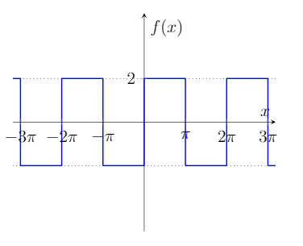
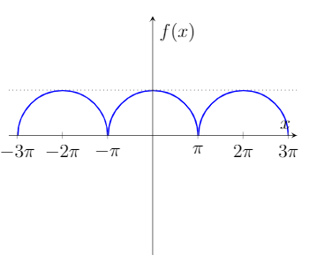
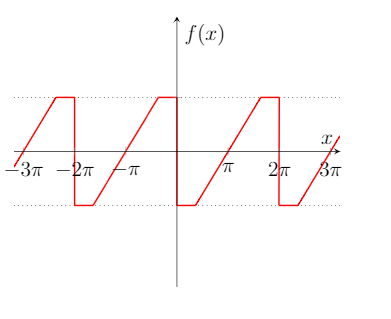

<link rel="stylesheet" type="text/css" media="all" href="styles.css">

# Fourier series, Tutorial sheet 10

### Additional resources
* [SJC - Fourier Series](https://youtu.be/rbRwhrNQnH0)
* [An Interactive Introduction to Fourier Transforms - Jez Swanson](http://www.jezzamon.com/fourier/index.html)
* [But what is the Fourier Transform? A visual introduction.](https://youtu.be/spUNpyF58BY)
* [What is up with Noises? (The Science and Mathematics of Sound, Frequency, and Pitch) - Vihart](https://youtu.be/i_0DXxNeaQ0)
* [JPEG 'files' & Colour (JPEG Pt1) - Computerphile](https://youtu.be/n_uNPbdenRs)

    

# Problem sheet
## Essential Questions
### Problem 1.
State the time period and formula of the following periodic functions.

(a)
<!-- Calculator using the desmos API woooo -->

$\boxed{\text{Period} =2\pi \qquad f(x)=x, \space \text{for} -\pi < x < \pi}$

(b)

$\boxed{\text{Period} =2\pi \quad f(x)=\left\{
\begin{array}{ll}
\pi-x, &\quad 0 < x < \pi{} \\
0, &\quad \pi{} < x < 2\pi
\end{array}\right.
}$

(c)

$\boxed{\text{Period} = 2\pi \qquad f(x)=x^2, \text{ for } -\pi < x < \pi}$

-----------------------------------------------------------------------------------

### Problem 2.
Sketch the following periodic functions, stating their period:

(a) $f(x) = 3\sin\left(\frac{x}{2}\right)$, over the interval $-\pi < x < 2\pi$ for $-4\pi < x < 4\pi.$

$\Rightarrow{} \text{Period} = 3\pi$

(b) 
$f(t) = \left\\{ 
\begin{array}{ll}
-t &\quad -\pi < t < 0 \newline
t &\quad 0 < t < \pi \end{array}\right.$
for  $-3\pi< t < 3\pi$

$\Rightarrow{} \text{Period} = 2\pi$

(c) $f\left(p\right)=\left\\{\begin{array}{l}\frac{p^2}{2}\ \ \ \ \ 0 < p <4 \newline
    8\ \ \ \ \ \ 4 < p < 6 \newline
    0\ \ \ \ \ \ 6 < p < 8 \end{array}\right.
    $
    for $-16<p<16$
 

$\Rightarrow{} \text{Period} = 8$

 

(d) $f\left(q\right)=2q-q^2\ \ \ \ \ 0< q < 2$, for $-8 < q < 8$
 

$\Rightarrow{} \text{Period} = 2$

 

------------------------------------

### Problem 3.
State whether the following functions are periodic, and if so, find their period:

(a) $\cos(x) + \sin(2x)$

Periodic: Summing two periodic functions results in a function that is still periodic.
The period of $\text{cos}(x) = 2\pi$ and $\text{sin}(2x) = \pi$. The lowest common multiple of $\pi$ and $2\pi$ is equal to the period of $\text{cos}(x) + \text{sin}(2x)$.

$\Rightarrow{} \boxed{ \text{Period } =2\pi}$

(b) $\sin{\left(x\right)}\cos{\left(x\right)}$

Periodic: Multiplying two periodic functions results in a function that is still periodic.
Using trigonometric identities $\text{sin}(x)\text{cos}(x)$ can be rewritten as $\frac{1}{2}\text{sin}(2x)$ which has a period of $\pi$.

$\Rightarrow{} \boxed{ \text{Period } = \pi}$

(c) $e^x\sin^2(x)$

Not periodic: Multiplying a periodic function, $sin^2(x)$, with a non periodic function, $e^x$, results in a non periodic function. If you're struggling to show that $sin^2(x)$ is periodic, try writing it in terms of functions of $2x$.

$\Rightarrow{} \boxed{ \text{Not periodic }}$

------------------------------------

### Problem 4.
Determine if the function $f(x)$ is odd, even, or neither.

(a) $f\left(x\right)=\ x^2\sin{(2x)}$

 Break the function up: $x^3$ is an even function and $\text{sin}(2x)$ is an odd function. An even function multiplied by an odd function results in an odd function.
$\\ \Rightarrow \boxed{\text{Odd function}}$

(b) $f\left(x\right)=3\sin{\left(x\right)}\cos{\left(4x\right)}$

Break the function up: $3$ is an even function, $\text{sin}(x)$ is an odd function and $\text{cos}(4x)$ is an even function. An even function multiplied by an odd function, multiplied by an even function results in an odd function.
$\\ \Rightarrow \boxed{\text{Odd function}}$

(c) $f\left(x\right)=x^3e^3$

Break the function up: $x^3$ is an odd function and $e^3$ is an even function. An odd function multiplied by an even function results in an odd function.
$\\ \Rightarrow \boxed{\text{Odd function}}$

(d)

$\Rightarrow \boxed{\text{Odd function}}$

(e)

$\Rightarrow \boxed{\text{Even function}}$

(f)

$\Rightarrow \boxed{\text{Odd function}}$

------------------------------------

### Problem 5.
For the following functions
(I) Find the Fourier coefficients and series in the given interval,
(II) Plot the function and the given partial sum over the given interval.

(a) $f\left(x\right)=x^3,\ \ \ for\ \left[ -1,1\right]$, with n = 5

The first step is to work out whether the function $f\left(x\right)=x^3$ is odd, even, or both. This can be done by eye for a simple function like $x^3$. To check, or for harder functions, the formulae found in the notes can be used:

$$
f_{\textrm{even}}(x)=\frac{f(x)+f(-x))}{2} \qquad \qquad
f_{\textrm{odd}}(x)=\frac{f(x)-f(-x))}{2}
$$

the function $f\left(x\right)=x^3$ is odd, so the Fourier series representation will only contain sine terms.

The sine coefficients can be found using:

$$
b_n = \frac{1}{L} \int_{-L}^{L}f(x)\sin\left(\frac{n\pi x}{L}\right) dx
$$

where $L=1$ and $f(x) = x^3.$ Plugging these values in, we get:

$$
b_n = \int_{-1}^{1}x^2\sin\left(n\pi x\right) dx.
$$

This can be integrated quickly using WolframAlpha: 

"integrate x^3 sin(n*pi*x) between -1 and 1" [Link.](https://www.wolframalpha.com/input/?i=integrate+x%5E3+sin%28n*pi*x%29+between+-1+and+1) 

This results in: 

\begin{align*}
b_n  &= \frac{6(\pi^2n^2 - 2)\sin(\pi n) - 2\pi n (\pi^2 n^2 - 6) \cos(\pi n)}{\pi^4 n^4} \newline
&= -(-1)^n \frac{2( \pi^2 n^2 - 6)}{\pi^4 n^4} \text{ when } n \in \mathbb{Z} \text{ (when n is an integer.)}
\end{align*}

(the function simplification can be found by examining the values of $\sin(\pi n)$ and $\cos(\pi n)$ when $n$ is an integer)

 

To integrate manually, use integration by parts: $\int f^{'}g=fg-\int fg^{'}.$

\begin{align*}
f = x^3, & df = 3x^2 dx
g = -\frac{\cos(\pi n x)}{\pi n}
\end{align*}

$$
= \left. \left(-\frac{x^3 cos(\pi n x)}{\pi n} \right) \right\vert^1_{-1} + \frac{3}{\pi n} \int^1_{-1}x^2 \cos(\pi n x) dx
$$ 

Repeating twice more to bring $x^2$ down to $1$ and then integrating the remaining expression, results in:

$$
= -\frac{12 \sin(\pi n)}{\pi^4 n^4} + \frac{12 \cos(\pi n)}{ \pi^3 n^3} + \frac{6 \sin(\pi n)}{\pi^2 n^2} - \frac{2 \cos(\pi n)}{\pi n}
$$

$\therefore$ the Fourier series representation is:

$$ \boxed{
f\left(x\right)=\sum_{n=1}^{\infty{}}{(-1)}^n\frac{2(6-n^2{\pi{}}^2)}{n^3{\pi{}}^3}\
\sin{(n\pi{}x)}
}$$
<iframe src="https://www.desmos.com/calculator/vxqjspzae0" width="850px" height="500px" style="border: 1px solid #ccc" frameborder=0></iframe>

(Try moving the slider under N)

(b) $f\left(x\right)=\left \\{\begin{array}{l}1+x,\ \ \ \ \ for\ -1\leq{}x\leq{}0 \newline
1,\ \ \ \ \ \ \ \ \ \ for\ 0 < x\leq{}1\end{array} \right. $
with n = 2

This function has both odd and even parts, so both $a_n$ and $b_n$ must be found. 

First looking at the $a_n$ coefficient:
    
\begin{align*}
a_n&=\frac{1}{L} \int_{-L}^{L}f(x)\cos\left(\frac{n\pi x}{L}\right) dx
\newline
&=
\int_{-1}^{0}(x+1)\cos\left(\frac{n\pi x}{L}\right) dx + \int_{0}^{1}\cos\left(\frac{n\pi x}{L}\right) dx
\end{align*}

The second integral is straight forward:

$$
\int_{0}^{1}\cos\left(\frac{n\pi x}{L}\right) dx = \left. \frac{1}{n\pi{}}\sin{\left(n\pi{}x\right)} \right\vert_{-1}^1=\frac{1}{n\pi{}}\left(0-0\right)=0
$$

The first integral can be done quickly using WolframAlpha: "integrate (x+1)cos(n* pi x) from -1 to 0" which evaluates to:

$$\frac{1 - \cos(\pi n)}{\pi^2 n^2} =  \frac{1 - (-1)^n}{\pi^2 n^2}.$$

To do this manually, apply integration by parts:

\begin{align*}
\int_{-1}^{0}(x+1)\cos\left(\frac{n\pi x}{L}\right) dx &=\left[ \frac{\left(1+x\right)\sin{\left(n\pi{}x\right)}}{n\pi{}}+{\frac{\cos(n\pi{}x)}{n^2{\pi{}}^2}} \right]\binom{0}{-1}
\newline
\newline
&=
\frac{1}{n^2{\pi{}}^2}\left[ 1-\cos{n\pi{}} \right],\ \ \ for\ any\ n\geq{}1,
\newline
\newline
\Rightarrow{} a_n &=\frac{1}{n^2{\pi{}}^2}\left[ 1-{\left(-1\right)}^n \right]. 
\end{align*}

For $a_0$ sub in $n = 0$:

\begin{align*}
a_0=\int_{-1}^1f(x)\
dx=\int_{-1}^0(1+x)dx+\int_0^1dx=\
\left.\left(x+\frac{1}{2}x^2\right)\right\vert{}\binom{0}{-1}+1 =\frac{3}{2}
\end{align*}

Similarly,

\begin{align*}
b_n &= \int_{-1}^1f\left(x\right)\sin{n\pi{}x\
dx=}\int_{-1}^0\left(1+x\right)\sin{n\pi{}x\ dx+}\int_0^1\sin{n\pi{}x\ dx\ }
\newline \newline
&=\
-\frac{1}{n\pi{}}-\frac{1}{n\pi{}}\left[ \cos{n\pi{}-1} \right]=\frac{ {\left(-1\right)}^{n+1}}{n\pi{}}
\end{align*}

Thus,

$$ \boxed{ f\left(x\right) =
\frac{3}{4}+
\frac{1}{ {\pi{}}^2}\sum_{n=1}^{\infty{}}\frac{1 - (-1)^n}{n^2}\cos(n\pi{}x)
+\frac{1}{\pi{}}\sum_{n=1}^{\infty{}}\frac{ {\left(-1\right)}^{n+1}}{n} \sin⁡(n\pi{}x)
}$$

<iframe src="https://www.desmos.com/calculator/6lglrfcrfl" width="850px" height="500px" style="border: 1px solid #ccc" frameborder=0></iframe>

(c) $f\left(x\right)=\left\\{\begin{array}{l}0,\ \ \ \ \ if\ -2\leq{}x\leq{}-1 \newline
    1,\ \ \ \ \ if\ -1 < x < 1 \newline
    0,\ \ \ \ \ if\ \ 1\leq{}x\leq{}2\end{array}\right.
    $

Starting with $a_0$,

$$
a_0=\frac{1}{2L}\int_{-L}^Lf\left(x\right)dx = \frac{1}{4}\int_{-1}^1 1 \space dx = \frac{1}{2}
$$

Moving onto the $a_n$ terms:

\begin{align*}
a_n &= \frac{1}{L}\int_{-L}^Lf\left(x\right)\cos{\left(\frac{n\pi{}x}{2}\right)}dx = \frac{1}{2}\int_{-1}^1 1 \cdot \cos{\left(\frac{n\pi{}x}{2}\right)dx}	
\newline \newline
&=
\frac{2}{n\pi{}}\sin{\left(\frac{\pi{}}{2}n\right)}.
\end{align*}

And finally, the $b_n$ terms will all be $0$ because the function is even (and therefore would contain no odd Fourier series components), so

$$b_n = 0.$$

Thus
$$
\boxed{f(x) = 
\frac{1}{2}+\sum_{n=0}^{\infty{}}\frac{2}{n\pi{}}\sin{\left(\frac{\pi{}}{2}n\right)} \cdot \cos\left(\frac{\pi}{2}nx\right)}
$$

<iframe src="https://www.desmos.com/calculator/qrmj8iw5ha" width="850px" height="500px" style="border: 1px solid #ccc" frameborder=0></iframe>

(d) $f\left(x\right)=\sin{\left(x\right)}{cos}^2\left(x\right),\ \ \ on\
    [ -\pi{},\pi{} ]$

To shortcut this problem, you can make the guess (after plotting the function, perhaps) that $\sin(x)\cos(x)^2$ might be able to be rearranged into a sum of sine components. Entering "sin(x)cos(x)^2" and going to the "Alternate form" section in WolframAlpha reveals that 

$$\sin(x)\cos(x)^2 = \boxed{ \frac{1}{4}\sin(x) + \frac{1}{4}\sin(3x) }$$

This function can already directly be represented in terms of a sum of sine components and therefore, we do not need to compute the series within the given interval (this would reveal that there is an exact approximation with a finite number of terms; the two we just found).

 

To compute terms manually, using the definition of the Fourier series:

Note that $f(x)=\sin\left(x\right)\cos^2\left(x\right)$ is odd on the interval $\left[ -1,1\right ]$. Therefore, the Fourier series representation will only contain sine $b_n$ terms.

$$
b_n=\frac{1}{\pi{}}\int_{-\pi{}}^{\pi{}}f(x)\sin{\left(\frac{n\pi{}x}{\pi{}}\right)\ dx=}\
\frac{2}{\pi{}}\int_0^{\pi{}}\sin{(x)}\
{\cos}^2\left(x\right)\sin{\left(nx\right)}dx\
$$

Substituting $\sin{2x}=2\sin{x}\cos{x}$,

$$
b_n=\frac{1}{\pi{}}\int_0^{\pi{}}\cos{\left(x\right)}\sin{(2x)}\sin{\left(nx\right)}\ dx
$$

Using the sine product to sum identity,

$$
\sin{(nx)}\sin{(2x)}=\frac{1}{2}[ \cos{(nx-2x)}-\cos{(nx+2x)}]
$$

$$
b_n=\frac{1}{\pi{}}\int_0^{\pi{}}(\cos{x})\frac{1}{2}\left[ \cos{\left(n-2\right)}x-\cos{\left(n+2\right)x}\right]\
dx
$$

$$
=\ \frac{1}{2\pi{}}\int_0^{\pi{}}\cos{x}\cos{(n-2)}x\
dx-\frac{1}{2\pi{}}\int_0^{\pi{}}\cos{x}\cos{(n+2)x}\ dx
$$

Using the cosine product to sum identity;
For the first integral on the right

$$
\frac{1}{2\pi{}}\int_0^{\pi{}}\frac{1}{2}\left[ \cos{\left(\left(n-2\right)+1\right)x+\cos{\left(\left(n-2\right)-1\right)x}}\right]\
dx
$$

$$
=\frac{1}{4\pi{}}\
\left[ \frac{\sin{(n-1)x}}{n-1}+\frac{\sin{(n-3)x}}{n-3}\right]\binom{\pi{}}{0}=0
$$

Provided $n\not=1,3$. Similarly, the second integral is also zero. It remains to find what happens at n=1, and n=3.

$$
b_1=\frac{2}{\pi{}}\int_0^{\pi{}}{\sin}^2\left(x\right){\cos}^2\left(x\right)\
dx=\frac{2}{\pi{}}\int_0^{\pi{}}\left(\sin{x}\right).(\frac{1}{2}\sin{2x}\cos{x})dx
$$

$$
=\frac{2}{\pi{}}.\frac{1}{4}\int_0^{\pi{}}{\sin}^2\left(2x\right)\
dx=\frac{1}{2\pi{}}\int_0^{\pi{}}\frac{1-\cos{4x}}{2}\ dx
$$

$$
b_3=\frac{2}{\pi{}}\int_0^{\pi{}}\sin{x}{\cos}^2x\sin{3x}\ dx=\
\frac{1}{\pi{}}\int_0^{\pi{}}\cos{x}\sin{2x}\sin{3x\
dx}
$$

$$
=\frac{1}{\pi{}}\int_0^{\pi{}}(\cos{x})\frac{1}{2}\left[ \cos{\left(3x-2x\right)-\cos{\left(3x+2x\right)}}\right]\
dx=\frac{1}{2\pi{}}\int_0^{\pi{}}{\cos}^2x dx-\frac{1}{2\pi{}}\int_0^{\pi{}}\cos{x\cos{5x}}dx\
$$

For the first integral,

$$
\frac{1}{2\pi{}}\int_0^{\pi{}}\frac{1+\cos{2x}}{2}dx=\frac{1}{4\pi{}}\left[ x+\frac{1}{2}\sin{2x}\right]\binom{\pi{}}{0}=\frac{1}{4}
$$

For the second integral,

$$
\frac{1}{2\pi{}}\int_0^{\pi{}}\frac{1}{2}\left[ \cos{\left(5x+x\right)+\cos{\left(5x-x\right)}}\right]dx=\frac{1}{4\pi{}}\int_0^{\pi{}}(\cos{6x+\cos{4x)}}dx
$$

$$
=\frac{1}{4\pi{}}\left[ \frac{1}{6}\sin{6x}+\frac{1}{4}\sin{4x}\right]\binom{\pi{}}{0}=0
$$

So $b_3=\frac{1}{4}$, meaning the Fourier series representation is:

$$\boxed{
f\left(x\right)\approx b_1\sin{x}+b_3\sin{3x}\approx \frac{1}{4}\sin{x}+\frac{1}{4}\sin{3x}
}$$

<iframe src="https://www.desmos.com/calculator/qtufiqgvrl" width="850px" height="500px" style="border: 1px solid #ccc" frameborder=0></iframe>

(e) $f\left(x\right)=\left\\{\begin{array}{l}\sin{\left(\frac{\pi{}x}{2}\right)},\ \ \
    \ for-2\leq{}x\leq{}0 \newline
    0,\ \ \ \ \ \ \ \ \ \ \ \ \ for\
    0 < x\leq{}2\end{array}\right.
    $ with n=3

Function neither odd nor even $\therefore$ requires both sine and cosine terms.

Expressions for terms can be found quickly using Wolfram Alpha: 

$a_0 = $ "integrate 1/2 * sin(pi * x / 2)cos(pi * x / 2) from -2 to 0"  
$a_n = $ "integrate 1/2 * sin(pi * x / 2)cos(n* pi * x / 2) from -2 to 0"  
$b_n = $ "integrate 1/2 * sin(pi * x / 2)sin(n* pi * x / 2) from -2 to 0"  

 

To compute manually:

$a_n$ coefficients:

\begin{align*}
a_n &=\frac{1}{2}\int_{-2}^2f\left(x\right)\cos{\left(\frac{n\pi{}x}{2}\right)dx=}\frac{1}{2}\int_{-2}^0\sin{\left(\frac{\pi{}x}{2}\right)\cos{\left(\frac{n\pi{}x}{2}\right)}}\
dx
\newline \newline
&=
\frac{1}{2}\int_{-2}^0\frac{1}{2}\left[ \sin{\left(\frac{\left(1+n\right)\pi{}x}{2}\right)}+\sin{\left(\frac{\left(1-n\right)\pi{}x}{2}\right)}\right]\
dx
\newline \newline
&=
\frac{1}{4}\left[ -\frac{2}{\pi{}\left(1+n\right)}\cos{\frac{\left(1+n\right)\pi{}x}{2}}-\frac{2}{\pi{}\left(1+n\right)}\cos{\frac{\left(1-n\right)\pi{}x}{2}}\right]\binom{0}{-2}
\newline \newline
&=
-\frac{1}{4} \left( \frac{4}{\pi{}\left(1+n\right)\left(1-n\right)}+\frac{ {\left(-1\right)}^n4}{\pi{}\left(1+n\right)\left(1-n\right)} \right) =\frac{ {\left(-1\right)}^{n+1}-1}{\pi{}\left(1+n\right)\left(1-n\right)},\
\ \ \ \ for\ \ n\not=1
\newline \newline
a_1 &= \frac{1}{2}\int_{-2}^0\sin{\left(\frac{\pi{}x}{2}\right)\cos{\left(\frac{\pi{}x}{2}\right)\
dx=\frac{1}{4}}}\int_{-2}^0\sin{\pi{}x}\ \ dx=0,\ \ \ \ for\ n=1
\end{align*}

$b_n$ coefficients:

\begin{align*}
b_n &= \frac{1}{2}\int_{-2}^2f\left(x\right)\sin{\left(\frac{n\pi{}x}{2}\right)dx=\frac{1}{2}}\int_{-2}^0\sin{\left(\frac{nx}{2}\right)}\sin{\left(\frac{n\pi{}x}{2}\right)}dx
\newline \newline
&=
\frac{1}{2}\int_{-2}^0\frac{1}{2}\left[ \left(\cos{\frac{\left(1-n\right)\pi{}x}{2})-(\cos{\frac{\left(1+n\right)\pi{}x}{2}}}\right)\right]\ dx
\newline \newline
&=
\frac{1}{4}\left[ \frac{2}{\pi{}\left(1-n\right)}\sin{\frac{\left(1-n\right)\pi{}x}{2}}-\frac{2}{\pi{}\left(1+n\right)}\sin{\frac{\left(1+n\right)\pi{}x}{2}}\right]\binom{0}{-2}=0,\
\ \ \ for\ n\not=1
\newline \newline
b_1 &= \frac{1}{2}\int_{-2}^0\sin^2{(\frac{\pi{}x}{2})} dx
=\frac{1}{2}\int_{-2}^0\frac{1-\cos{\pi{}x}}{2}\
dx=\frac{1}{4}\left[ x-\frac{1}{\pi{}}\sin{\pi{}x}\right]\binom{0}{-2}=\frac{1}{2}\
,\ \ \ \ for\ n=1\
\end{align*}

Therefore, the fourier series representation is:

$$ \boxed{
f\left(x\right)\approx\frac{-1}{\pi{}}+\frac{1}{2}\sin{\left(\frac{\pi{}x}{2}\right)+\frac{1}{\pi{}}\sum_{n=2}^{\infty{}}\frac{ {\left(-1\right)}^{n+1}-1}{1-n^2}\cos{ \left(\frac{n\pi{}x}{2} \right)}}
}$$

<iframe src="https://www.desmos.com/calculator/cepdzyeggd" width="850px" height="500px" style="border: 1px solid #ccc" frameborder=0></iframe>

---------------
## Exam Style Questions
### Problem 6.
**(a)** Given the real Fourier series expansion for a periodic function, $f(x)$, with a $2\pi{}$ period,
$$
f\left(x\right) = \frac{1}{2}a_0+\sum_1^{\infty{}}(a_n\cos{\left(nx\right)}+b_n \sin{(nx)}) \space ,
$$
find an expression for the coefficients, $C_n$, of the complex Fourier series,
$$
f\left(x\right) = \sum_{n=-\infty}^{\infty} C_n e^{i n x}
\space .
$$
Give your answer in terms of the real coefficients $a_0$, $a_n$, and $b_n$.

Next express $C_n$ in terms of $f(x)$.

Comment on the relationship between $C_n$ and $C_{-n}$ for real functions.

Looking at the complex Fourier series, there are three differences from the real series:
there is a complex exponential instead of sines and cosines;
the sum is from $-\infty$ to $\infty$ rather than $1$ to $\infty$;
and there is an $a_0$ term.
Let's treat these in order.

First, use Euler's identity to convert the complex exponential to trig functions,

$$f\left(x\right) = \sum_{n=-\infty}^{\infty} C_n \left(
  \cos(n x) + i \sin(n x) \right)
\space .$$

Next, split out the sum into three parts, negative, zero, positive,
\begin{align*}
f\left(x\right) &=
\sum_{n=-1}^{-\infty} C_n \left( \cos(n x) + i \sin(n x) \right) \newline
&+ C_0 \newline
&+ \sum_{n=1}^{\infty} C_n \left( \cos(n x) + i \sin(n x) \right)
\;.
\end{align*}
For the negative sum, we can substitute $n$ for $-n$ as it is a variable within the sum (being summed over). Changing the limits and the coefficient to represent the same negative sum. Noting that $\cos$ is an even function and $\sin$ is odd so that $i \sin(n x)$ becomes $-i \sin(n x)$.
\begin{align*}
f\left(x\right) &=
\sum_{n=1}^{\infty} C_{-n} \left( \cos(n x) - i \sin(n x) \right) \newline
&+ C_0 \newline
&+ \sum_{n=1}^{\infty} C_n \left( \cos(n x) + i \sin(n x) \right)
\;.
\end{align*}
Now the sums are over the same range, they can be combined,
\begin{align*}
f\left(x\right) &= C_0 +
\sum_{n=1}^{\infty} \left( (C_n + C_{-n}) \cos(n x) + i(C_n - C_{-n}) \sin(n x) \right)
\;.
\end{align*}
By inspection, we can now compare terms from our expression to the real Fourier series,
\begin{align*}
    a_0 &= 2 C_0 \newline
    a_n &= C_n + C_{-n} \newline
    b_n &= i C_n -i C_{-n}
\end{align*}
Then to solve this part, rearrange these simultaneous equations in terms of $a_n$, $b_n$
\begin{align*}
    C_0 &= \frac{a_0}{2} \newline
    C_n &= \frac{a_n - i b_n}{2} \newline
    C_{-n} &= \frac{a_n + i b_n}{2}
\end{align*}

For the next part, we'll take our expression for $C_n$ and write the $a$ and $b$ terms as their integral forms.
\begin{align*}
C_n &= \frac{a_n - i b_n}{2} \newline
&= \frac{1}{2}\left(\frac{1}{\pi}\int_{-\pi}^{\pi} f(x) \cos(n x)- i \frac{1}{\pi}\int_{-\pi}^{\pi} f(x) \sin(n x) \right) \newline
&= \frac{1}{2\pi}\int_{-\pi}^{\pi} f(x) \left( \cos(n x)- i \sin(n x) \right) \newline
C_n &= \frac{1}{2\pi}\int_{-\pi}^{\pi} f(x) e^{-i n x}
\end{align*}

Finally for the comment,
given $C_n = (a_n - i b_n) / 2$
and $C_{-n} = (a_n + i b_n) / 2$,
then for real functions, $a$ and $b$ are real,
so $C_{-n} = C_n^*$

**(b)** Find the real Fourier series to the following function.
$$\left(3+4i\right)e^{-2ix}+{\left(3-4i\right)e}^{2ix}$$

$$
\Rightarrow{}\left(3+4i\right)\left[ \cos{\left(2x\right)-i\sin{\left(2x\right)}}\right]+\left(3-4i\right)\left[ \cos{\left(2x\right)+i\sin{\left(2x\right)}}\right] \\\\
$$

$$
=\left(3+4i\right)\cos{\left(2x\right)+}\left(4-3i\right)\sin{\left(2x\right)+}\left(3-4i\right)\cos{\left(2x\right)+\left(4+3i\right)\sin{\left(2x\right)}} \\\\
$$

$$
=\left[ \left(3+4i\right)+\left(3-4i\right)\right]\cos{\left(2x\right)+\left[ \left(4-3i\right)+\left(4+3i\right)\right]\sin{\left(2x\right)}} \\\\
$$

$$
=6\cos{(2x)}+8\sin{(2x)} \\\\
$$

In second line, we must use the fact that $\left(3+4i\right)i=\ -4+3i$ and $\left(3-4i\right)i=4+3i$ in finding the coefficients in front of the $\sin{(2x)}$ term.

----------------------
## Challenging Questions
### Problem 7.
In the following exercises, find the complex Fourier series representation of the given function $f(x)$ over the interval [-$\pi{}$, $\pi{}$]

(a) $f(x) = x^3$

$$
C_n=\frac{1}{2\pi{}}\int_{-\pi{}}^{\pi{}}x^3e^{-inx}dx
$$

Using the integration by parts, we have

\begin{align*}
C_n &=\frac{1}{2\pi{}}\left[ \frac{ {ix}^3e^{-inx}}{n}+\frac{ {3x}^2e^{-inx}}{n^2}-\frac{ {i6xe}^{-inx}}{n^3}-\frac{ {6e}^{-inx}}{n^4}\right]\binom{\pi{}}{-\pi{}} 
\newline \newline 
&=\
\frac{1}{2\pi{}n^4}\left[ e^{-inx}(in^3x^3+3n^2x^2-i6nx-6\right]\binom{\pi{}}{-\pi{}}
\newline \newline
&=\
\frac{1}{2\pi{}n^4}\left[ {\left(-1\right)}^n\left(-in^3{\pi{}}^3+{3n}^2{\pi{}}^2-i6n\pi{}-6\right)-{\left(-1\right)}^n(-in{\pi{}}^3+3n^2{\pi{}}^2+i6n\pi{}-6\right]
\newline \newline
&=
\frac{ {(-1)}^n}{2\pi{}n^4}\left[ {2in}^3{\pi{}}^3-12in\pi{}\right]=\frac{ {\left(-1\right)}^n}{n^3}\left(n^2{\pi{}}^2-6\right), \ \ \ \ for\ n\not=0 \newline \newline
\end{align*}

$$
\Rightarrow \quad C_0=\frac{1}{2\pi{}}\int_{-\pi{}}^{\pi{}}x^3dx=0,\ \ \ for\ n=0
$$

Since $x^3$ is odd on $\left[ -\pi{},\pi{}\right]$. Hence,

$$
f\left(x\right)=\
\sum_{n=-\infty{}}^{\infty{}}C_ne^{inx}=\sum_{n\not=0}\frac{ {\left(-1\right)}^ni(n^2{\pi{}}^2-6)}{n^3}e^{inx}
$$

(b) $f\left(x\right)=\left\\{\begin{array}{l}0,\ \ \ -\pi{}\leq{}x<0, \newline
1,\ \ \ \ \ 0\leq{}x<\ \pi{}\end{array}\right.$

$$
C_n=\frac{1}{2\pi{}}\int_{-\pi{}}^{\pi{}}f(x)e^{-inx}dx=\frac{1}{2\pi{}}\int_0^{\pi{}}e^{-inx}dx=\frac{1}{2\pi{}}\left[\frac{e^{-inx}}{-in}\right]\binom{\pi{}}{0} \\\\
$$

$$
=-\frac{1}{2\pi{}in}\left[ e^{-inx}-1\right]=\frac{1-{(-1)}^n}{2\pi{}in} \\\\
$$

$$
\Rightarrow{}\ \ \left\{\begin{array}{l}0,\ \ \ \ \ \ \ \ n\ even, \newline
\frac{1}{\pi{}in},\ \ \ \ n\ odd,\ \end{array}\right.\ ,\ for\ n\not=0. \\\\
$$

$$
C_0=\frac{1}{2\pi{}}\int_{-\pi{}}^{\pi{}}f\left(x\right)dx=\frac{1}{2\pi{}}\int_0^{\pi{}}dx=\frac{1}{2},\
\ \ \ \ \
$$

Thus,

$$
f\left(x\right)\approx\sum_{n=-\infty{}}^{\infty{}}C_ne^{inx}=\frac{1}{2}+\sum_{n\
odd}\frac{1}{\pi{}in}e^{inx}
$$

## Answers

<button type="button" onclick="displayAnswerButtons('block')">Show answer buttons</button>
<button type="button" onclick="displayAnswers('block')">Show all answers</button>
<button type="button" onclick="displayAnswers('none')">hide all answers</button>

  

# Next week, Multivariate Calculus!